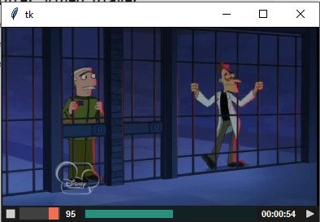

# widget tkinter video player
widget para tkinter de video usando MPV embebido (incrustado), tiene opciones basicas, para usar como widget de vista previa de video para otros programas




realizado con:
* python 3.12
* tkinter
* mpv (https://mpv.io)

**Librerias**
* [python-mpv	0.3.0](https://github.com/jaseg/python-mpv) y mpv-2.dll

La libreria **mpv.py** no es nesesario instalarla se puede copiar directamente en el proyecto, igualmente el dll `mpv-2.dll`

```python
rz = tk.Tk()
rz.geometry("400x240")
mp = MiPlayerMPV(rz)
mp.reproduce(r"mi_video.mp4")
mp.pack(fill='both', expand=1)
rz.mainloop()
```

## FUNCIONES
de momento hace lo mas basico:
* botones play-pause, stop
* reproduce desde un tiempo dado - timestamp o segundos '00:01:23' o 83
* muestra el tiempo transcurrido con una barra de progreso (solo muestra no se puede mover)
* muestra el  volumen con un slider que se puede regular
* atajos de teclado
	* *flecha arriba* - sube volumen
	* *flecha abajo* - baja volumen
	* *espacio* - play o pausa

se agrego algunas teclas rapidas:
* **espacio** para pausar o reproducir el video
* **flecha arriba** para subir el volumen
* **flecha abajo** para bajar el volumen

para activar las teclas rapidas se debe agregar la siguiente linea:
```python
mp._teclas_rapidas_mi_player(rz)
```
y pasar como argumento la ventana principal para funcionen, en este caso mi ventana pricipal es **rz**

---
se corrigio el valor maximo de la barra de progreso del tiempo para que se cambie de acuerdo a la duracion del video en segundos

por si le agrego mas cosas dejo este link https://mpv.io/manual/master/ que es donde se encuentra el manual de mpv

